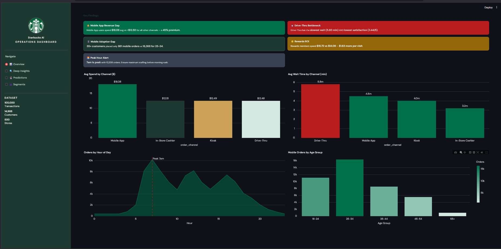
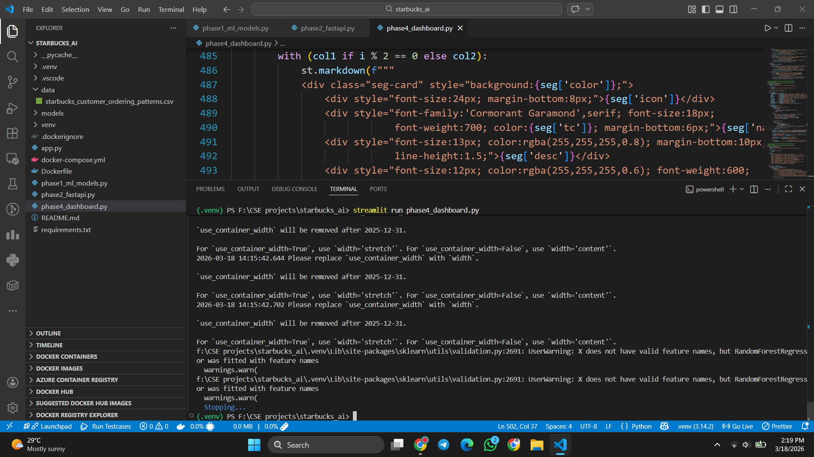
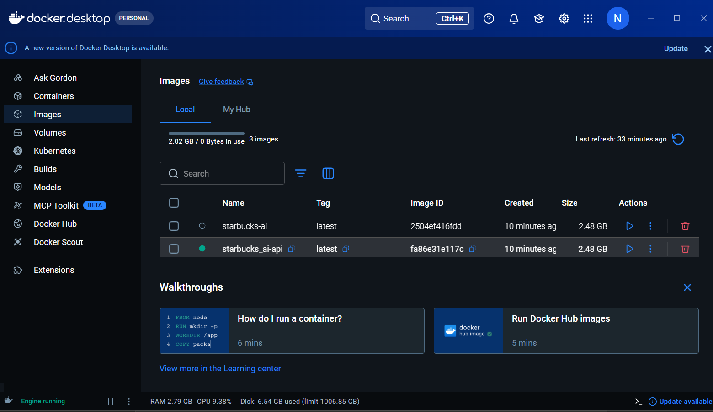

# ☕ Starbucks AI Operations Dashboard



---

## 📸 Screenshots

<table>
  <tr>
    <td></td>
    <td></td>
  </tr>
  <tr>
    <td align="center"><b>📊 Overview Dashboard</b></td>
    <td align="center"><b>🔍 Deep Insights</b></td>
  </tr>
  <tr>
    <td colspan="2" align="center"></td>
  </tr>
  <tr>
    <td colspan="2" align="center"><b>🐳 Docker Containers Running</b></td>
  </tr>
</table>

---

## 🧠 What This Project Does

Analyzes 100,000 Starbucks customer transactions across 500 stores (Jan 2024 – Dec 2025) to build an AI-powered operations intelligence system.

**Key findings from the data:**
- 📱 Mobile App users spend **$18.08 avg** — 45% more than other channels
- ⏱️ Drive-Thru has the **slowest wait (5.80 min)** and lowest satisfaction
- 👴 55+ customers placed only **981 mobile orders** vs 16,368 for 25-34
- ⭐ Rewards members spend **$1.63 more** per visit
- 🌅 Peak hour is **7am** with 10,208 orders

---

## 🗺️ Project Map

```
starbucks-ai/
├── screenshots/                                    
├── data/
│   └── starbucks_customer_ordering_patterns.csv  
│
├── models/                                        
│   ├── spend_prediction_model.pkl
│   ├── wait_time_model.pkl
│   ├── kmeans_model.pkl
│   ├── label_encoders.pkl
│   └── cluster_scaler.pkl
│
├── phase1_ml_models.py      ← Data analysis + ML training
├── phase2_fastapi.py        ← REST API server
├── phase4_dashboard.py      ← Streamlit web dashboard
├── Dockerfile               ← Docker container definition
├── docker-compose.yml       ← Multi-service orchestration
├── requirements.txt         ← All dependencies
└── .gitignore
```

---

## 📦 Dataset

**Source:** [Starbucks Customer Ordering Patterns — Kaggle](https://www.kaggle.com/datasets/likithagedipudi/starbucks-customer-ordering-patterns)

| Property | Value |
|---|---|
| Rows | 100,000 transactions |
| Columns | 20 features |
| Missing values | None |
| Period | Jan 2024 – Dec 2025 |
| Stores | 500 locations |
| Regions | Northeast, Southeast, Midwest, West, Southwest |

> Download the CSV from Kaggle and place it in the `data/` folder.

---

## 🚀 Option A — Run with Docker (Recommended)

**Step 1:** Install Docker Desktop from https://www.docker.com/products/docker-desktop

**Step 2:** Clone the repo and add your CSV
```bash
git clone https://github.com/nazrana-nahreen/starbucks-ai.git
cd starbucks-ai
```

**Step 3:** Train the models
```bash
python phase1_ml_models.py
```

**Step 4:** Start everything
```bash
docker-compose up --build
```

**Step 5:** Open in browser
- Dashboard → http://localhost:8501
- API Docs  → http://localhost:8000/docs

**Stop:**
```bash
docker-compose down
```

---

## 🛠️ Option B — Run Locally

```bash
# Create virtual environment
python -m venv venv
venv\Scripts\activate        # Windows
source venv/bin/activate     # Mac/Linux

# Install dependencies
pip install -r requirements.txt

# Train models
python phase1_ml_models.py

# Start API (keep running)
python phase2_fastapi.py

# Open dashboard (new terminal)
streamlit run phase4_dashboard.py
```

---

## 📊 Dashboard Pages

| Page | Description |
|---|---|
| 📊 Overview | KPIs, key findings, trend charts |
| 🔍 Deep Insights | Region, drink, satisfaction breakdown |
| 🔮 Predictions | ML-powered spend & wait time predictions |
| 👥 Segments | AI customer persona classification |

---

## 🤖 ML Models

| Model | Algorithm | Predicts |
|---|---|---|
| Spend Prediction | Random Forest Regressor | Total customer spend |
| Wait Time Prediction | Random Forest Regressor | Order fulfillment time |
| Customer Segmentation | K-Means Clustering | Customer persona (4 groups) |

---

## 🛠️ Tech Stack

`Python` · `Pandas` · `Scikit-learn` · `FastAPI` · `Streamlit` · `Plotly` · `Docker` · `docker-compose`
